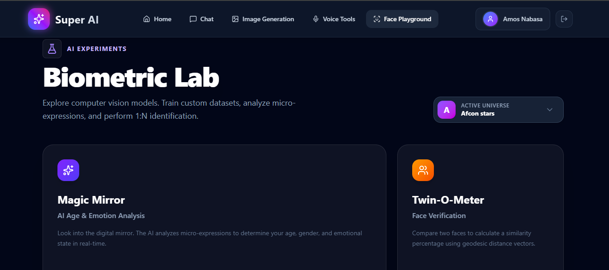

This is the final touch! A professional `README.md` transforms your code from a "project" into a "product." It tells recruiters and developers exactly what you built and how complex the architecture is.

Here is a comprehensive, production-grade README. Create a file named **`README.md`** in your root folder and paste this in.

***

# 💎 Prism AI: The Biometric Intelligence Platform


*(Replace this with a screenshot of your Dashboard/Playground)*

**Prism AI** is a production-grade SaaS platform that combines **Computer Vision**, **Biometric Security**, and **Generative AI (RAG)** into a unified interface.

It features a microservices architecture separating the "Manager" (Node.js) from the "Brain" (Python AI), enabling scalable face recognition, liveness detection, and document intelligence.

---

## 🚀 Live Demo

*   **Frontend:** [https://prism-vision.vercel.app](https://prism-vision.vercel.app)
*   **Backend API:** [https://super-ai-backend.onrender.com/graphql](https://super-ai-app.onrender.com/graphql)
*   **AI Engine:** [https://amosquety-biometric-brain.hf.space](https://amosquety-biometric-brain.hf.space)

*(Note: Services are hosted on free tiers and may experience "Cold Starts" of 30-60s on first load.)*

---

## ✨ Key Features

### 🛡️ Biometric Security Center
*   **Face ID Login:** Passwordless authentication using 512-dimensional vector embeddings.
*   **Liveness Detection:** Anti-spoofing system that analyzes micro-expressions (e.g., "Smile to Unlock") to prevent photo attacks.
*   **Global Identity Index:** Centralized vector database for secure user verification.

### 🧪 The Biometric Lab (Playground)
*   **Magic Mirror:** Real-time analysis of Age, Gender, and Emotional State using DeepFace.
*   **Twin-O-Meter:** Calculates facial similarity percentage between two photos (1:1 Verification).
*   **Crowd Scanner:** 1:N Identification to pinpoint a target face within a group photo using RetinaFace detectors.
*   **Workspace Management:** Multi-tenant architecture allowing users to create isolated "Universes" (e.g., Marvel vs. Family) with separate facial databases.

### 🧠 The Knowledge Brain (RAG)
*   **Chat with Data:** Upload PDF documents and chat with them.
*   **Vector Search:** Uses Google Gemini Embeddings + pgvector to retrieve relevant context chunks.
*   **Hybrid Intelligence:** Smart routing between "Context-Aware" answers and "General Knowledge" based on the user's prompt.

---

## 🏗️ Architecture & Tech Stack

The system follows a **Distributed Microservices** pattern:

### 1. Frontend (The Experience)
*   **Framework:** React 18 + Vite + TypeScript
*   **State:** Apollo Client (GraphQL) + Context API
*   **Styling:** Tailwind CSS + Framer Motion (Liquid UI)
*   **Hosting:** Vercel

### 2. Backend Gateway (The Manager)
*   **Runtime:** Node.js + Express
*   **API:** Apollo Server (GraphQL)
*   **Database ORM:** Prisma
*   **Security:** Stateless JWT Auth + Singleton DB Pattern
*   **Hosting:** Render

### 3. AI Engine (The Brain)
*   **Runtime:** Python 3.9 + FastAPI
*   **ML Libraries:** DeepFace (TensorFlow/Keras), OpenCV, NumPy
*   **Models:** FaceNet512 (Recognition), VGG-Face (Analysis)
*   **Hosting:** Hugging Face Spaces (Dockerized)

### 4. Infrastructure (The Memory)
*   **Database:** Supabase PostgreSQL + `pgvector` extension.
*   **Storage:** Supabase Storage (S3-compatible) for images.
*   **LLM Provider:** Google Gemini 1.5 Flash (with Key Rotation & Rate Limiting).

---

## 🛠️ Local Installation

### Prerequisites
*   Node.js v18+
*   Python 3.9+
*   PostgreSQL (or Supabase account)

### 1. Clone the Repo
```bash
git clone https://github.com/AmosQuety/Super-AI-App.git
cd Super-AI-App
```

### 2. Backend Setup (Node.js)
```bash
cd src/apps/backend
npm install

# Setup Environment
cp .env.example .env
# (Fill in DATABASE_URL, JWT_SECRET, SUPABASE_KEYS, GEMINI_KEYS)

# Run Database Migrations
npx prisma db push
npx prisma generate

# Start Server
npm run dev
```

### 3. Frontend Setup (React)
```bash
cd src/apps/web
npm install

# Setup Environment
echo "VITE_GRAPHQL_URL=http://localhost:4001/graphql" > .env

# Start Client
npm run dev
```

### 4. AI Engine Setup (Python)
```bash
cd FaceSearchProject
python -m venv myenv
source myenv/bin/activate  # or myenv\Scripts\activate on Windows

pip install -r requirements.txt

# Setup Environment
# Create .env with SUPABASE_URL and SUPABASE_KEY

# Start API
uvicorn api:app --reload --port 8000
```

---

## 🧩 System Design Highlights

### 🔄 Smart Key Rotation
To bypass API rate limits on free tiers, the system implements a **Round-Robin Key Rotator** for Gemini and Hugging Face APIs, effectively tripling the available quota.

### ⚡ Optimistic UI Updates
The frontend uses Apollo Client cache updates (`refetchQueries` and `optimisticResponse`) to ensure the UI feels instant, even when waiting for server logic.

### 🐳 Dockerized AI
The Python brain is containerized using a custom `Dockerfile` that pre-downloads heavy ML weights (500MB+) during the build phase, ensuring fast startup times on serverless platforms.

---

## 🛡️ License

This project is open-source and available under the **MIT License**.

---

## 👨‍💻 Author

**Nabasa Amos**
*   Full Stack Software Engineer & AI Enthusiast
*   [GitHub](https://github.com/AmosQuety)