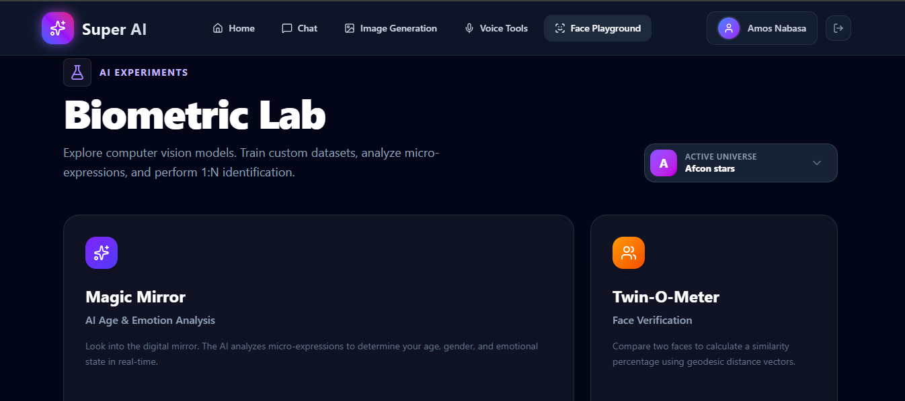

# 💎 Xemora: Biometric Intelligence Platform

A production-grade, multi-modal AI workspace integrating **Biometric Security**, **Computer Vision**, and **Generative Intelligence** into a premium interface.



---

## 🚀 Live Demo
*   **Frontend:** [https://prism-vision.vercel.app](https://prism-vision.vercel.app)
*   **Video Demo:** [https://youtu.be/E5pNRct9X4Q](https://youtu.be/E5pNRct9X4Q)

---

## ✨ Features

### 📈 Core Dashboard (The Experience)
*   **Bento Grid Interface:** High-end modular dashboard with real-time telemetry and activity chips.
*   **Liquid UI Experience:** Smooth state transitions and glassmorphism powered by **Framer Motion 12**.
*   **Global Quick Actions:** Rapid access to face analysis, content drafting, and voice tools from any page.
*   **Recent AI Tasks:** Persistent side panel tracking long-running operations (Voice synthesis, RAG indexing).

### ☄️ Blaze Intelligence (Personalization)
*   **Persona Tuning:** Configure AI tone (Casual/Formal), technical depth, and verbosity.
*   **Context Injection:** Define domain expertise and goals for hyper-personalized responses.
*   **Dynamic UI**: Real-time interface updates based on persona preferences.

### 🛡️ Biometric Security & SOC
*   **Face ID Identity**: Passwordless login using 512-dimensional vector embeddings and **Magic Mirror** emotion analysis.
*   **Voice Identity Login**: Multi-factor authentication via **SpeechBrain** speaker verification and challenge-response phrase matching.
*   **Security Operations Center (SOC)**: Real-time audit logs monitoring biometric enrollment and verification events.

### 🧪 The Biometric Lab (Vision Playground)
*   **Magic Mirror**: Real-time analysis of age, gender, and emotional state using **DeepFace**.
*   **Twin-O-Meter**: 1:1 facial verification calculating similarity percentages between two images.
*   **Crowd Scanner**: 1:N identification for pinpointing target faces in complex group photos using **RetinaFace**.

### 🎙️ Voice Intelligence Layer
*   **Interactive AI Orb**: A pulsing 3D visualizer that reacts to live voice input.
*   **High-Fidelity Voice Cloning**: Zero-shot voice synthesis using **XTTS v2**.
*   **Babel Fish Translator**: Instant AI translation across multiple languages (Spanish, French, Japanese, Luganda, Chinese).
*   **Brain Dump Summarizer**: Real-time condensation of voice sessions into actionable notes.

### 🧠 Knowledge Brain (RAG)
*   **Chat with Data**: Interactive PDF interaction using hybrid semantic search via **Prisma pgvector**.
*   **Job Pipeline**: Robust handling of large document indexing and audio processing via **BullMQ** and **Redis**.

---

## 🏗️ Architecture & Tech Stack

### 1. Frontend (Web & Mobile)
*   **Web**: React 19, Vite 7, TypeScript, Tailwind CSS 4, Apollo Client 4.
*   **Mobile**: React Native (Expo), NativeWind, React 19, Lucide icons.
*   **State**: Apollo Client (GraphQL) + React Context API.

### 2. Backend Gateway (Node.js)
*   **Runtime**: Node.js + Express.
*   **API**: Apollo Server (GraphQL) with real-time subscriptions for AI job updates.
*   **Database**: PostgreSQL + **Prisma ORM**.
*   **Storage**: **Supabase Storage** (S3-compatible) & **Cloudinary** for biometric assets.
*   **Task Queue**: **BullMQ** + **Redis** for asynchronous AI processing.

### 3. AI Engine (Python)
*   **Framework**: FastAPI.
*   **Vision**: DeepFace, RetinaFace, MTCNN, OpenCV.
*   **Voice**: Coqui XTTS v2, SpeechBrain, OpenAI Whisper.
*   **Execution**: Optimized for both GPU (CUDA) and OOM-protected CPU modes (4GB RAM safe-mode).

---

## 🛠️ Local Installation

### 1. Prerequisite: AI Engine
The AI Engine lives in a separate repository: **[FaceSearch](https://github.com/AmosQuety/FaceSearch)**. 

1. **Clone & Run FaceSearch**: Clone the repository and follow its specific setup guide (installing Python dependencies, setting up models, etc.).
2. **Set Service URL**: Once the AI Engine is running (default: `http://localhost:8000`), ensure `PYTHON_FACE_SERVICE_URL=http://localhost:8000` is set in your **Backend Gateway** `.env` file.


### 2. Backend Gateway (Node.js)
```bash
cd backend
npm install
npx prisma generate
npm run dev # Runs on Port 4001
```

### 3. Frontend Web (React)
```bash
cd web
npm install
npm run dev # Runs on Port 5173
```

---

## ⚙️ Environment Variables

### Backend (`backend/.env`)
| Variable | Description |
| :--- | :--- |
| `DATABASE_URL` | PostgreSQL connection string (with pgvector support) |
| `SUPABASE_URL` | Supabase API endpoint |
| `SUPABASE_KEY` | Supabase Service Role Key |
| `GEMINI_API_KEY` | Google Generative AI key (Gemini 1.5 Flash) |
| `SERVICE_API_KEY` | Shared secret with the Python AI Engine |
| `PYTHON_FACE_SERVICE_URL` | URL of the Python API (Default: http://127.0.0.1:8000) |
| `REDIS_URL` | Redis instance for BullMQ and Caching |

### Frontend (`web/.env.local`)
| Variable | Description |
| :--- | :--- |
| `VITE_GRAPHQL_URL` | URL of the Gateway (Default: http://localhost:4001/graphql) |

---

## 📁 Project Structure
```text
.
├── backend/            # Node.js Gateway (GraphQL, Prisma, BullMQ, RAG)
├── web/                # React 19 Frontend (Bento Grid, Apollo, Tailwind 4)
├── mobile/             # Expo React Native App
└── packages/           # Shared monorepo packages (ai-orchestrator, types, ui)
```

---

## 👨‍💻 Author
**Nabasa Amos**
*   [GitHub](https://github.com/AmosQuety)
*   Distributed under the **MIT License**.
